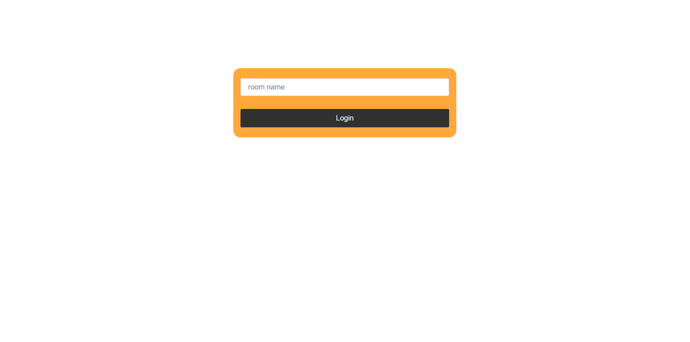
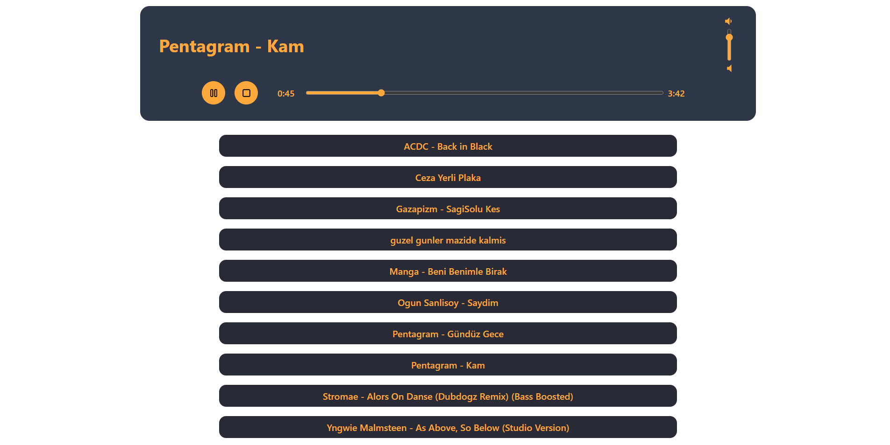
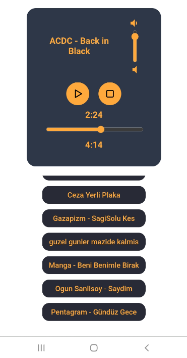

# Socket.IO Collaborative Music Player


### Used Packages

**SocketIO:** socket io client (must be version 2)

**React icons**: icon package

### How to run

#### clone the project: https://github.com/gurkanucar/mp3-player-fe

```bash
  git clone https://github.com/gurkanucar/mp3-player-fe
  cd mp3-player-fe
```

#### install packages

```bash
  npm install
```

#### run app

```bash
  npm start
```

### Note that!
#### You have to configure ip and port details from "apiConstants" file.

export const SOCKET_BASE_URL = "http://192.168.0.10:8085"; // write your ip address not local host

export const API_BASE_URL = "http://192.168.0.10:8080"; // write your ip address not local host

## Example Video:

[https://www.youtube.com/watch?v=IfaBerTl_PI](https://www.youtube.com/watch?v=IfaBerTl_PI)

## Example Images:








### Backend:

[https://github.com/gurkanucar/mp3-player-be](https://github.com/gurkanucar/mp3-player-be)


